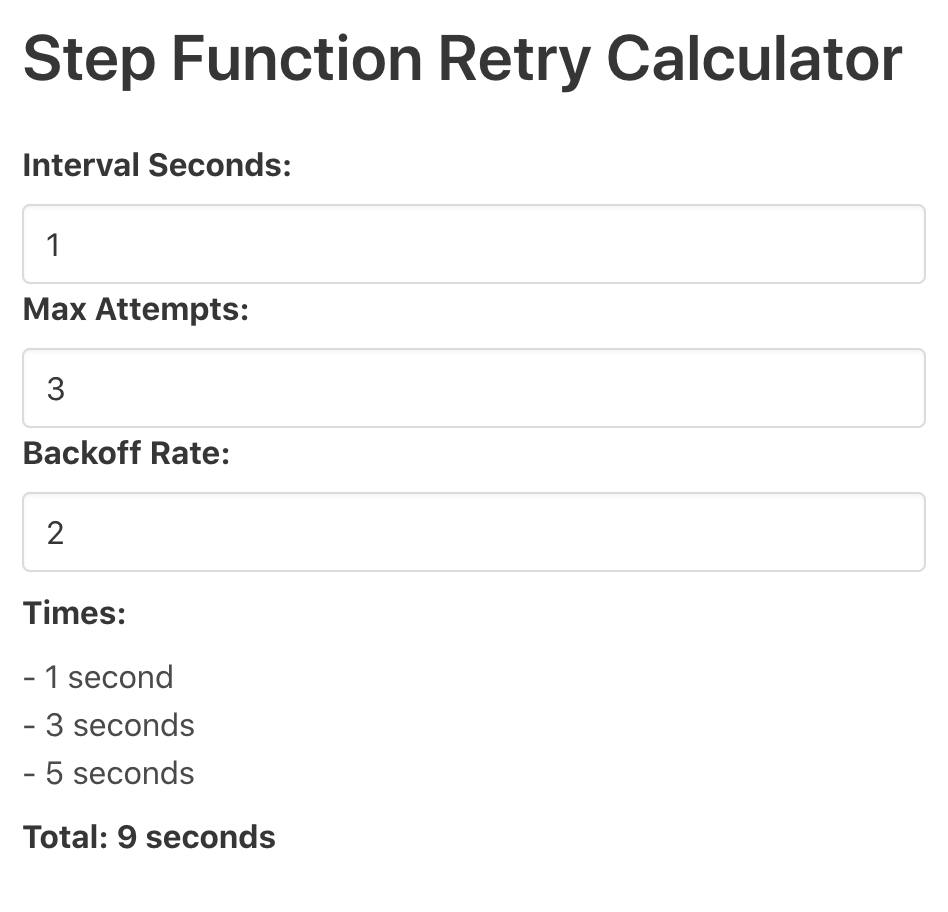

# What

Helps visualize how long your retries will take in a Step Function. Uses [Elm](https://elm-lang.org/) for the code, and [Bulma](https://bulma.io/) for the CSS.

</img>

# Building

To see it yourself:

1. run `npm install`
2. run `npm start`
3. open a browser at `http://localhost:8000`

To make an optmized build, run `npm run build`.

# Why

AWS Step Functions allow you to orchestrate microservices. One of their killer features is [retry](https://docs.aws.amazon.com/step-functions/latest/dg/concepts-error-handling.html); they handle all the state of retry, and they can run for up to a year. While that's great, sometimes during development, or perhaps for timeout reasons, you don't want your retries to take that long.

Step Functions offer 3 properties that a `Task` can use to define this retry:
- `IntervalSeconds`: How long to wait.
- `MaxAttempts`: How many times to retry.
- `BackoffRate`: Each time it backs off, it'll multiply this times the `IntervalSeconds`.

Now, even an art student like me can do the `IntervalSeconds` and `MaxAttempts` math in my head.

> MaxAttempts is 3, and IntervalSeconds is 1, so... it'll try, fail, 1 second later try again, fail, try again 1 second later, fail, then try again a final time 1 second later.

Once you put `BackoffRate` in there, though... my brain kind of melts. Worse, I'll sometimes get angry at some unstable downstream service I'm testing, and wonder why my Step Function didn't timeout after 30 minutes and it ends up I set the retry time way higher than my patience.

This UI helps you see the math instantly, and visualize the calls. For example, most defaults go like this:

`IntervalSeconds` = 1
`MaxAttempts` = 3
`BackoffRate` = 2

Which means she'll:

1. try
2. fail and wait 1 second
3. try again
4. fail and wait 2 seconds
5. try again
6. fail and wait 4 seconds
7. then try again a final time.

Sometimes, however, you may be in a QA environment, and don't want to [exponentially back off](https://aws.amazon.com/blogs/architecture/exponential-backoff-and-jitter/). You know either service just constantly and randomly goes down despite plenty of infrastructure resources, or you know the developers are taking the service down but don't really care about when they say it'll come back up.

`IntervalSeconds` = 3
`MaxAttempts` = 10
`BackoffRate` = 1

In this case, she'll:

1. try
2. fail and wait 3 seconds
3. try again
4. fail and wait 3 seconds
5. try again

... and on and on 8 more times. No jitter, no slowly calling each time to be nice to the server and DDOS, nope, just "Are we there yet? Are we there yet?"

